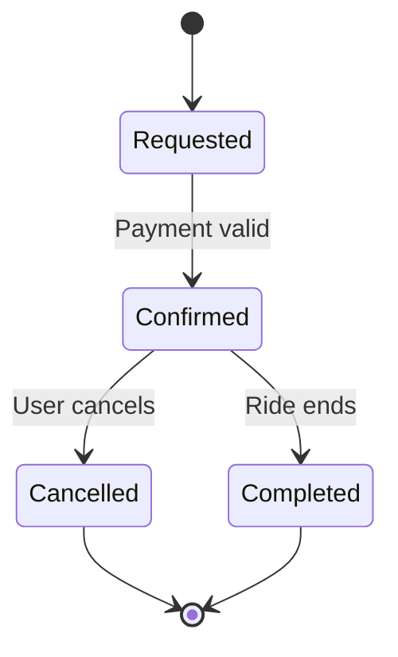

### Booking - State Diagram

```mermaid
stateDiagram-v2
    [*] --> Requested
    Requested --> Confirmed: Payment valid
    Confirmed --> Cancelled: User cancels
    Confirmed --> Completed: Ride ends
    Cancelled --> [*]
    Completed --> [*]
```
**Explanation:** This diagram maps to FR-003 (Allow booking cancellation) and US-005 (As a user, I want to cancel my ride).