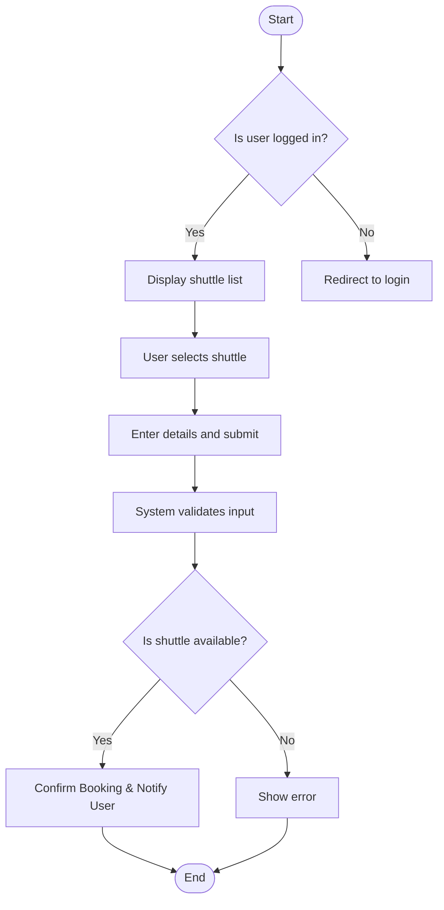

### Booking a Shuttle - Activity Diagram

```mermaid
flowchart TD
    A([Start]) --> B{Is user logged in?}
    B -- Yes --> C[Display shuttle list]
    B -- No --> D[Redirect to login]
    C --> E[User selects shuttle]
    E --> F[Enter details and submit]
    F --> G[System validates input]
    G --> H{Is shuttle available?}
    H -- Yes --> I[Confirm Booking & Notify User]
    H -- No --> J[Show error]
    I --> K([End])
    J --> K
```
**Explanation:** Addresses FR-002 and US-003. Booking logic is validated and confirmation sent in real-time.