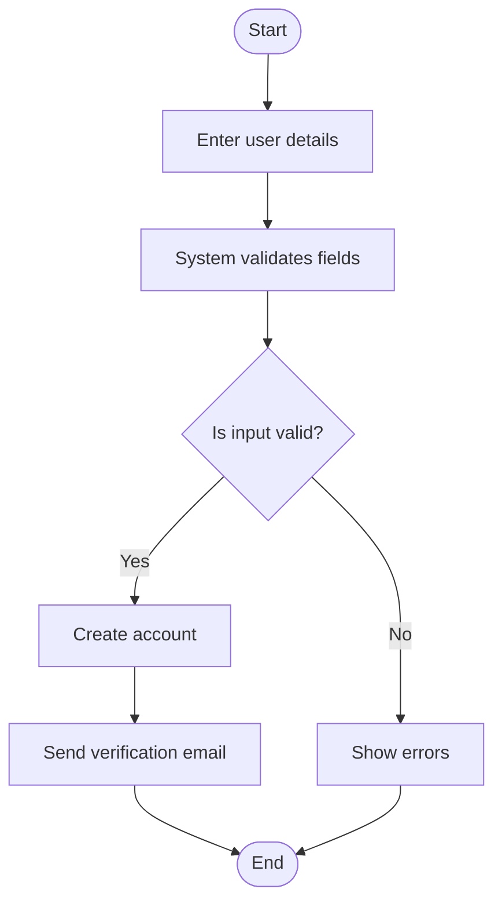

### User Registration - Activity Diagram

```mermaid
flowchart TD
    A([Start]) --> B[Enter user details]
    B --> C[System validates fields]
    C --> D{Is input valid?}
    D -- Yes --> E[Create account]
    D -- No --> F[Show errors]
    E --> G[Send verification email]
    G --> H([End])
    F --> H
```
**Explanation:** Covers FR-001 and supports US-001 (user wants to register). Input validation and email confirmation ensure secure onboarding.